# ML Ecommerce Chatbot

<div align="center">
  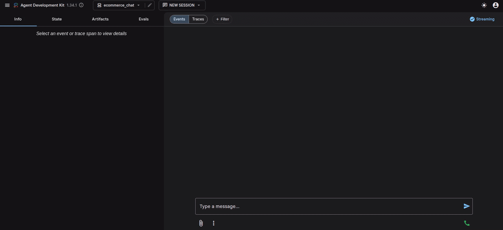
  <br>
  <strong>Interactive GenAI Chat to Classical ML Pipeline</strong>
  <br>
  <em>A seamless, real-time product recommendation engine powered by Google ADK and tabular machine learning models.</em>
</div>

## ML Engineering Approach

This project serves as a modern blueprint for integrating **Generative AI** with **Classical Machine Learning**:

- **GenAI Feature Extraction**: Uses Google ADK and LLMs (Llama 3.1, GPT-4o) to dynamically extract structured inputs (e.g. `Gender: 0`) from free-form natural language chat.
- **Robust Classical ML Pipeline**: Evaluates XGBoost, CatBoost, Random Forest, Logistic Regression, and LDA. Features automated `Hyperopt` CV search, `SMOTE` class balancing, and rich Markdown tracking of `f1_macro` and `log_loss`.
- **Real-Time Decoupled Inference**: The inference engine is a lightweight FastAPI microservice isolated in its own container, strictly keeping massive ML dependencies (Torch, XGBoost) out of the frontend chat memory space.
- **Cloud-Native Deployment (AWS Example)**: Fully codified via Terraform. Deploys the chat interface to EC2, state to RDS PostgreSQL, and the winning artifact to a scalable SageMaker Endpoint proxied through AWS Lambda.
- **Production-Style Quality Gates**: Uses Black for deterministic formatting, Prospector at `veryhigh` strictness across static checkers, and pytest coverage split into unit, integration, and fast e2e smoke/contract tests.

## Prerequisites

Before starting, ensure you have the following installed on your workstation:
- **Docker & Docker Compose** (for running the isolated services)
- **Python 3.14+**
- **Poetry** (version 2.4.1 recommended for dependency management)
- **Make** (for executing Makefile commands)

## Quickstart

Install dependencies:

```bash
make install
```

Train a small CPU-safe demo artifact:

```bash
make demo-train
```

Start local development services, the FastAPI prediction API, and ADK Web chat with local Ollama:

```bash
make up-dev-ollama
```

This runs in the foreground and streams logs from PostgreSQL, ClearML, ClearML Serving, FastAPI, ADK Web, and Ollama in the same terminal. Press `Ctrl-C` to stop the dev stack.

For OpenAI-backed chat, set `OPENAI_API_KEY` first and run:

```bash
make up-dev
```

Open the conversational ADK UI:

```text
http://localhost:8001
```

The prediction API remains available at:

```text
http://localhost:8000
```

When you run the Ollama-backed stack with `make up-dev-ollama`, the Compose
`ollama-pull` one-shot service pulls the configured local model into the
persistent Ollama volume. You can still pull it manually:

```bash
make ollama-pull OLLAMA_MODEL=llama3.1:8b
```

Stop local processes and supporting services:

```bash
make down-dev
```

## Model Selection

Run the full model-selection pipeline:

```bash
make select-model MAX_EVALS=20 CV_FOLDS=3 SMOTE=true CLEARML=true
```

Run a single model:

```bash
make train MODEL=xgboost MAX_EVALS=20
make train MODEL=randomforest MAX_EVALS=20
make train MODEL=catboost MAX_EVALS=20
make train MODEL=logistic_regression MAX_EVALS=20
make train MODEL=lda MAX_EVALS=20
```

Artifacts are written to:

```text
data/runs/classical_ml/<run_id>/
data/runs/classical_ml/<selection_id>/<run_id>/
data/evals/<run_id>.md
data/evals/<selection_id>/selection.md
data/evals/jobs/<eval_id>/
data/runs/classical_ml/latest_selection.json
```

After model selection, the API prefers the `best_artifact_dir` from
`data/runs/classical_ml/latest_selection.json`; otherwise it falls back to the
newest local directory containing `model.joblib`. Each run writes
`split_manifest.json`, `train_indices.json`, and `test_indices.json` so
evaluation jobs can reproduce train/test metrics.

Run split-aware evaluations:

```bash
poetry run evaluate --model-dir data/runs/classical_ml/<run_id> --split test
poetry run evaluate --model-dir data/runs/classical_ml/<run_id> --split train
poetry run evaluate-selection --split all
```

Evaluation jobs write metrics, reports, confusion-matrix charts, metric charts,
and SHAP summaries under `data/evals/jobs/`.

## ML Approach

The target is `ProductCategory`, a five-class classification problem. The chat and API collect only model features:

```text
Age
Gender
AnnualIncome
NumberOfPurchases
TimeSpentOnWebsite
LoyaltyProgram
DiscountsAvailed
PurchaseStatus
```

Implemented models:

| Model | Purpose |
| --- | --- |
| XGBoost | Strong gradient-boosted tree baseline for tabular classification |
| Random Forest | Robust bagged-tree baseline with class balancing |
| CatBoost | Boosting baseline with stable multiclass loss |
| Logistic Regression | Linear probabilistic baseline evaluated with log loss |
| Linear Discriminant Analysis | Statistical baseline using covariance shrinkage search |

Each model uses the same workflow interface:

```text
load dataset -> stratified split -> SMOTE training folds -> Hyperopt CV -> final fit -> metrics -> artifacts -> report
```

Tracked metrics:

```text
accuracy
balanced_accuracy
f1_macro
precision_macro
recall_macro
log_loss
confusion_matrix
classification_report
```

ClearML is optional per command. Local self-hosted ClearML is started by Docker Compose and exposed at:

```text
http://localhost:8080
```

Official reference: https://clear.ml/docs/latest/docs/deploying_clearml/clearml_server_linux_mac/

`make up-dev` starts the ClearML panel and ClearML Serving, but it does not train
models. Create the first tracked model artifacts from another terminal:

```bash
make clearml-model-selection MODELS=xgboost,randomforest MAX_EVALS=3 CV_FOLDS=3
```

For local self-hosted ClearML, the Compose API server and training CLI use the
same local SDK credentials by default:

```text
CLEARML_API_ACCESS_KEY=ml-ecommerce-local
CLEARML_API_SECRET_KEY=ml-ecommerce-local-secret
```

The Python config loads `.env` automatically for direct `poetry run ...`
commands, and `make` exports the same keys for Makefile commands.

These keys authenticate against your local ClearML server only. They are not
ClearML Cloud credentials. Change them in `.env` for your machine; Compose will
seed the local apiserver with the same values on startup.

Run the full tracked selection pipeline:

```bash
make clearml-model-selection MAX_EVALS=20 CV_FOLDS=3 SMOTE=true
```

With the full Docker Compose stack, start services in one terminal and run the
pipeline in another. The serving entrypoint creates or reuses
`data/clearml/serving.env` automatically:

```bash
docker compose up
docker compose run --rm api poetry run select-model --models all --max-evals 20 --cv-folds 3 --smote --clearml
```

ClearML logging includes:

```text
ClearML Dataset for the training CSV
ClearML Pipeline with dataset, candidate training, and finalization steps
Hyperopt trial table and CV metric curves
validation scalar metrics
confusion matrix plot/table
classification report
SHAP summary image when generated
model.joblib as task artifact
ClearML OutputModel entry for the model registry
deployment_manifest.json for the selected endpoint target
endpoint_manifest.json for ADK chat and FastAPI prediction endpoints
ClearML Serving product-category endpoint for the Model Endpoints tab
```

You can start only ClearML Serving locally when the ClearML server is already up:

```bash
make clearml-serving-up
```

`make clearml-model-selection` runs the ClearML Pipeline and then registers the
best model with ClearML Serving as:

```text
http://localhost:8082/serve/product-category
```

The runtime prediction endpoint is still FastAPI locally and SageMaker, Azure ML,
or Vertex AI in cloud deployments. ClearML is used here as the experiment,
dataset, artifact, and model-registry system; the selected endpoint metadata is
logged in `deployment_manifest.json`.

SMOTE is enabled by default through `ML_USE_SMOTE=true`. Disable it when you want a pure non-resampled baseline:

```bash
make select-model SMOTE=false
poetry run select-model --models all --no-smote
```

## Generative AI Fine-Tuning

To further specialize the ADK chatbot experience, this project includes a real **Parameter-Efficient Fine-Tuning (QLoRA)** path for local Ollama-backed models and cloud-job adapters for managed providers.

Using the `Bitext-retail-ecommerce-llm-chatbot-training-dataset`, the system maps raw instruction-response pairs into localized 4-bit `NF4` LoRA adapters. This drastically reduces VRAM requirements while improving domain-specific contextual awareness.

1. **Deterministic Processing**: The pipeline enforces a strict 90/10 Train/Test split, writing local `train.csv` and `test.csv` evaluation maps.
2. **ClearML Tracking**: `make finetune-ollama` enables ClearML by default, creates a ClearML Pipeline, registers the formatted SFT dataset, reports train/eval metrics, and registers the LoRA adapter as an OutputModel.
3. **Decoupled Architecture**: Instead of merging massive weights locally, the generated adapter is served by templating an Ollama `Modelfile`.

Provider status:

| Provider | Fine-tuning status | Dataset and deployment notes |
| --- | --- | --- |
| `ollama` | Fully local QLoRA path. Best demo path for no external credentials. | Uses Transformers/PEFT/TRL locally, saves a LoRA adapter, then serves it through Ollama `ADAPTER` in a generated Modelfile. Reference: [Ollama Modelfile](https://docs.ollama.com/modelfile). |
| `azure_openai` | Cloud fine-tuning job wrapper. Works after the training file is uploaded to Azure OpenAI. | `--data-path` must be an Azure file id like `file-...`; `--base-model-id` should be the fine-tunable Azure model id. Reference: [Azure fine-tuning jobs](https://learn.microsoft.com/en-us/rest/api/azureopenai/fine-tuning/create?view=rest-azureopenai-2024-10-21). |
| `bedrock` | Cloud Bedrock model-customization job wrapper. | `--data-path` must be an S3 URI. Terraform now creates the Bedrock customization role, output S3 URI, and `iam:PassRole` permission. Reference: [Bedrock model customization](https://docs.aws.amazon.com/bedrock/latest/APIReference/API_CreateModelCustomizationJob.html). |
| `vertex` | Cloud Vertex AI supervised tuning job wrapper. | `--data-path` must be a GCS URI. Terraform grants Vertex AI access plus object-admin access to the artifacts bucket. Reference: [Gemini supervised tuning](https://cloud.google.com/vertex-ai/generative-ai/docs/models/gemini-supervised-tuning). |

All four providers support ClearML tracking through `--clearml`. Ollama logs a real local adapter, train/eval metrics, and formatted SFT dataset. Azure OpenAI, Bedrock, and Vertex log the provider job as a ClearML Pipeline step with dataset reference, request/response manifest, submitted job id, and a remote-model registry entry.

Managed-provider endpoint serving is provider-owned: after Azure OpenAI, Bedrock, or Vertex finishes the fine-tuning job, set the resulting deployment/model id in `AZURE_OPENAI_DEPLOYMENT`, `BEDROCK_MODEL_ID`, or `VERTEX_MODEL_ID` before deploying the matching cloud infra.

Fine-tuning code is separated from provider adapters:

| Path | Responsibility |
| --- | --- |
| `src/finetuning/local_qlora.py` | Local QLoRA training, adapter registration, metrics, and ClearML OutputModel logging |
| `src/finetuning/clearml_pipeline.py` | ClearML Pipeline wrappers for Ollama and managed-provider fine-tuning |
| `src/finetuning/managed_tracking.py` | Azure OpenAI, Bedrock, and Vertex job manifest/model tracking |
| `src/providers/` | Thin LLM provider adapters for chat generation and provider job submission |

To run the fine-tuning locally (requires `llm-train` dependencies in `pyproject.toml`):

```bash
make finetune-ollama
```

By default this uses `tinyllama:1.1b` with
`TinyLlama/TinyLlama-1.1B-Chat-v1.0`, which is open and does not require
Hugging Face credentials. It trains on 200 samples for a fast real LoRA run.

For a full no-token TinyLlama run:

```bash
make finetune-ollama FINETUNE_MAX_TRAIN_SAMPLES=
```

For a larger Llama-style run, override both the Ollama serving tag and the HF
training checkpoint:

```bash
make finetune-ollama \
  FINETUNE_OLLAMA_MODEL=llama3.1:8b \
  FINETUNE_BASE_MODEL=unsloth/Meta-Llama-3.1-8B-Instruct-bnb-4bit \
  FINETUNE_MAX_TRAIN_SAMPLES=1000
```

To natively serve the fine-tuned adapter over the base model without duplicating gigabytes of weights:

```bash
make serve-finetuned-ollama ADAPTER_PATH=data/runs/llm_finetuning/<run_id>/adapter
```

Then start the single ADK Web chat against the finetuned local model:

```bash
make adk-web-finetuned
```

Or start the full dev stack against the finetuned local model:

```bash
make up-dev-ollama-finetuned
```

Register the latest LLM adapter as a ClearML Serving endpoint for the Model Endpoints tab:

```bash
make clearml-register-latest-llm
make clearml-serving-deploy-latest-llm
```

The ClearML LLM endpoint proxies to the finetuned Ollama model created by
`make serve-finetuned-ollama`.

Switching chat models:

| Target | Command or config |
| --- | --- |
| Normal local Ollama chat | `make up-dev-ollama OLLAMA_MODEL=llama3.1:8b` |
| Normal ADK Web only | `make adk-web LLM_PROVIDER=ollama OLLAMA_MODEL=llama3.1:8b` |
| Finetuned local Ollama chat | `make serve-finetuned-ollama ADAPTER_PATH=data/runs/llm_finetuning/<run_id>/adapter`, then `make up-dev-ollama-finetuned` |
| Finetuned ADK Web only | `make adk-web-finetuned` |
| Azure tuned model in cloud | Set `AZURE_OPENAI_DEPLOYMENT` or Terraform `azure_openai_deployment` to the tuned deployment name. |
| Bedrock tuned model in cloud | Set `BEDROCK_MODEL_ID` or Terraform `bedrock_model_id` to the custom Bedrock model id/ARN. |
| Vertex tuned model in cloud | Set `VERTEX_MODEL_ID` or Terraform `vertex_model_id` to the tuned Vertex/Gemini model id. |

ClearML views expected from future runs:

| Flow | ClearML output |
| --- | --- |
| `make finetune-ollama` | Pipeline step, SFT Dataset, live Trainer scalar curves, trainer log-history table, scalar curves for loss/learning-rate/grad-norm/token accuracy/eval metrics, adapter artifact, OutputModel, fine-tune manifest |
| `make clearml-model-selection` | Pipeline controller progress scalars, candidate training tasks with native XGBoost/CatBoost training-iteration curves, Hyperopt loss/best-loss/metric curves, trial tables, validation metrics, confusion matrix, SHAP image when generated, model artifacts, final ranking and endpoint manifests |
| Managed fine-tuning | Pipeline step, dataset reference manifest, provider request/response manifest, submitted job id, remote-model registry entry |

Managed provider examples:

```bash
poetry run finetune --provider azure_openai --base-model-id gpt-4.1-mini --data-path file-abc123 --epochs 3
poetry run finetune --provider bedrock --model meta.llama3-1-8b-instruct-v1:0 --data-path s3://bucket/train.jsonl --epochs 3
poetry run finetune --provider vertex --model gemini-2.5-flash --data-path gs://bucket/train.jsonl --epochs 3
```

Makefile wrappers with ClearML enabled:

```bash
make finetune-azure-openai FINETUNE_AZURE_FILE_ID=file-abc123
make finetune-bedrock FINETUNE_BEDROCK_DATA_URI=s3://bucket/train.jsonl
make finetune-vertex FINETUNE_VERTEX_DATA_URI=gs://bucket/train.jsonl
```

## CLI

All command-line entrypoints are Click commands registered in `interface/cli/app.py`. The command modules stay split by responsibility so CLI parsing remains separate from training, evaluation, prediction, fine-tuning, cloud submission, and ClearML cleanup logic.

Main grouped CLI:

```bash
poetry run ml-ecommerce-chatbot --help
poetry run ml-ecommerce-chatbot train --model xgboost --max-evals 20
poetry run ml-ecommerce-chatbot select-model --models all --smote --clearml
poetry run ml-ecommerce-chatbot evaluate --model-dir data/runs/classical_ml/<run_id> --split test
poetry run ml-ecommerce-chatbot evaluate-selection --split all
```

Direct script aliases:

```bash
poetry run train-model --model xgboost --max-evals 20
poetry run select-model --models all --max-evals 20 --smote --clearml
poetry run finetune --provider ollama --model tinyllama:1.1b --clearml
poetry run register-llm-adapter --adapter-path data/runs/llm_finetuning/<run_id>/adapter
poetry run evaluate --model-dir data/runs/classical_ml/<run_id> --split test
poetry run evaluate-selection --split all
poetry run predict --json '{"Age":40,"Gender":1,"AnnualIncome":65000,"NumberOfPurchases":8,"TimeSpentOnWebsite":31.5,"LoyaltyProgram":1,"DiscountsAvailed":2,"PurchaseStatus":1}'
poetry run cloud-train --provider gcp --models xgboost --max-evals 1
poetry run clean-clearml --dry-run
```

CLI files:

| Path | Responsibility |
| --- | --- |
| `interface/cli/app.py` | Main Click group and console-script wrappers |
| `interface/cli/training_commands.py` | `train` and `select-model` commands |
| `interface/cli/evaluation_commands.py` | `evaluate` and `evaluate-selection` commands |
| `interface/cli/prediction_commands.py` | `predict` command |
| `interface/cli/llm_commands.py` | LLM fine-tuning and adapter registration commands |
| `interface/cli/cloud_commands.py` | Cloud model-selection job submission command |
| `interface/cli/clearml_commands.py` | ClearML cleanup command |

## API Endpoints

| Method | Path | Purpose |
| --- | --- | --- |
| GET | `/health` | Health check |
| GET | `/` | Redirect to ADK Web UI |
| GET | `/models/latest` | Latest local model artifact status |
| GET | `/categories` | Product-category label mapping |
| POST | `/predict` | Predict product category from feature payload |

## UI Views

### ADK Chat Home

<div align="center">
  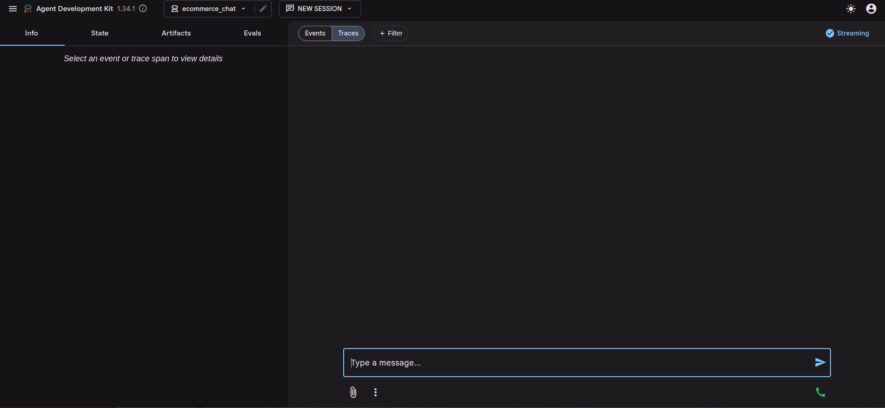
</div>

This is the user-facing Google ADK Web chat where the customer starts the product-category conversation. It is necessary because the system must collect structured model features from natural language before the tabular model can make a reliable prediction.

### Prediction Result in Chat

<div align="center">
  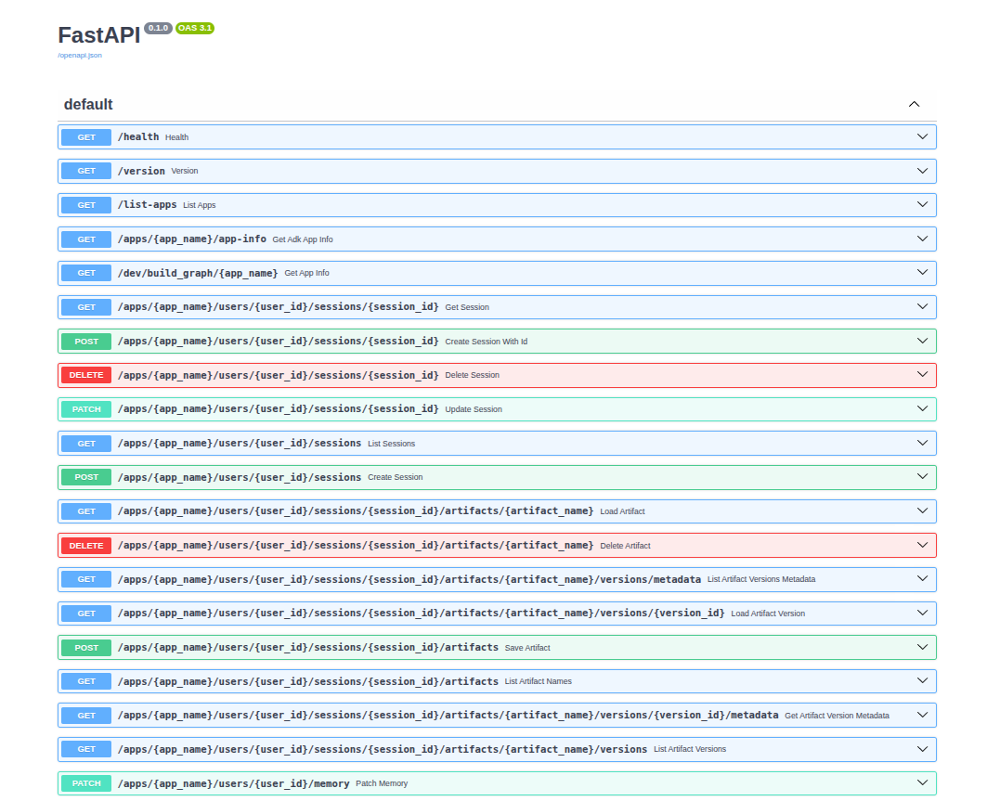
</div>

This view shows the final recommendation returned to the user after the agent calls the FastAPI prediction tool. It is necessary because it closes the loop between GenAI feature collection and the classical ML classifier, making the model output understandable in the conversation.

### ClearML Experiment Dashboard

<div align="center">
  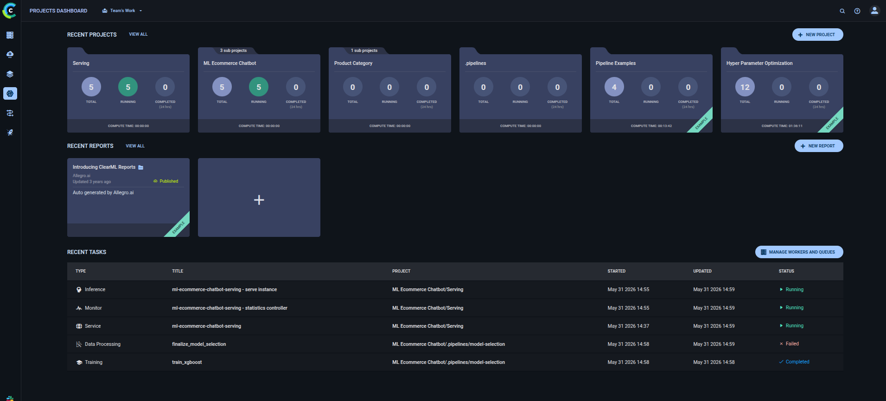
</div>

This dashboard tracks model-selection runs, validation metrics, artifacts, and optimization history across candidate models. It is necessary because model decisions must be auditable: the selected classifier should be backed by metrics, reports, and reproducible artifacts rather than a one-off local run.

### ClearML Training Pipeline

<div align="center">
  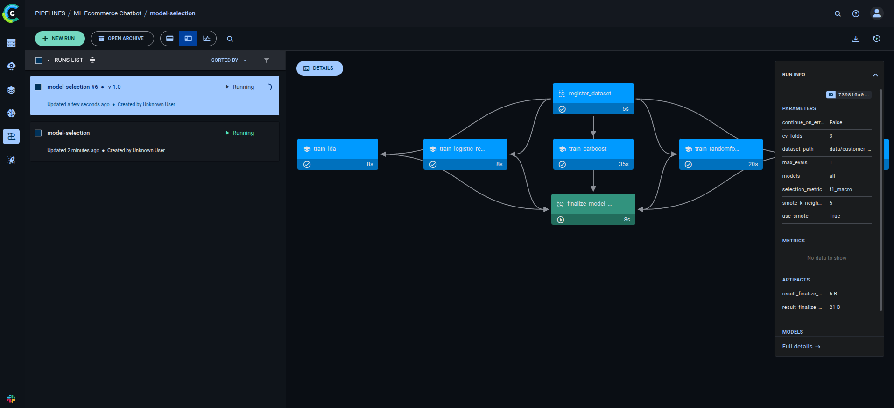
</div>

This view shows the tracked training workflow and its model-selection tasks inside ClearML. It is necessary because the training path includes multiple models, CV searches, and optional ClearML Pipeline steps, so a pipeline view makes progress, failures, and produced artifacts easy to inspect.

### ClearML Serving Endpoints

<div align="center">
  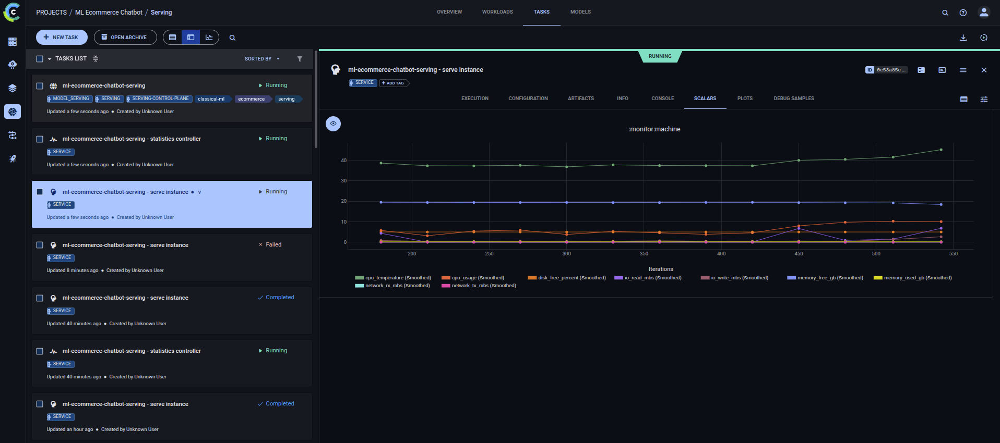
</div>

This view shows registered ClearML Serving endpoints and runtime status for deployed model artifacts. It is necessary because the project uses ClearML as the local registry and serving-control plane, so endpoint visibility confirms which model is available for inference and monitoring.

The only chat experience is Google ADK Web. The agent lives in `interface/chat/ecommerce_chat`, the instruction prompt is `interface/chat/ecommerce_chat/instructions.txt`, and the prediction tool is `interface/chat/ecommerce_chat/tools.py`. The tool calls the FastAPI `/predict` endpoint after the agent collects all required fields.

```bash
make adk-web
```

ADK sessions use PostgreSQL through `ADK_SESSION_SERVICE_URI`. FastAPI is only the backend prediction API; it does not expose a second chat UI.

Official references:

- https://google.github.io/adk-docs/get-started/python/
- https://google.github.io/adk-docs/agents/models/
- https://google.github.io/adk-docs/sessions/session/

## Environment Variables

`.env` should stay small: only secrets, private account IDs, or provider resources that cannot be safely committed. Pushable defaults such as local hosts, ports, regions, model names, default providers, ClearML project names, and serving endpoint names live in `master_config.py`; Makefile and Docker Compose keep local fallbacks for developer workflows.

Copy `.env.example` to `.env`, replace mock values, and fill only the providers or deployments you use. Do not commit `.env`.

| Variable | Required when | Description |
| --- | --- | --- |
| `POSTGRES_PASSWORD` | You override the local PostgreSQL password. | Secret used by local Compose/PostgreSQL and generated local database URLs; the existing `ml_chatbot` fallback still works for throwaway local dev. |
| `CLEARML_API_ACCESS_KEY` | You use ClearML SDK against local, shared, or ClearML Cloud servers. | Access key for experiment tracking and ClearML Serving registration. |
| `CLEARML_API_SECRET_KEY` | You use ClearML SDK against local, shared, or ClearML Cloud servers. | Secret key paired with `CLEARML_API_ACCESS_KEY`. |
| `OPENAI_API_KEY` | `LLM_PROVIDER=openai`. | OpenAI API key used by ADK/LiteLLM for OpenAI chat models. |
| `AZURE_OPENAI_API_KEY` | You use Azure OpenAI chat, fine-tuning, or Azure Terraform deployment. | Azure OpenAI API key; keep it in `.env` locally or GitHub Actions secrets in CI. |
| `AZURE_OPENAI_ENDPOINT` | You use an existing Azure OpenAI resource. | Account-specific Azure OpenAI endpoint URL for your resource. |
| `HF_TOKEN` | You use gated/private Hugging Face models or datasets. | Hugging Face token for local QLoRA downloads; `HUGGINGFACE_TOKEN` and `HUGGING_FACE_HUB_TOKEN` are also supported aliases. |
| `GCP_PROJECT_ID` | You use Vertex AI or GCP Terraform deployment. | Your GCP project id; this is account-specific even though model/location defaults are in `master_config.py`. |
| `AWS_ROLE_TO_ASSUME` | GitHub Actions deploys to AWS through OIDC. | IAM role ARN assumed by the deploy workflow. |
| `AZURE_CLIENT_ID` | GitHub Actions deploys to Azure. | Azure federated identity client id for `azure/login`. |
| `AZURE_TENANT_ID` | GitHub Actions deploys to Azure. | Azure tenant id for `azure/login`. |
| `AZURE_SUBSCRIPTION_ID` | GitHub Actions deploys to Azure. | Azure subscription id targeted by deployment workflows. |
| `GCP_WORKLOAD_IDENTITY_PROVIDER` | GitHub Actions deploys to GCP. | Workload Identity Federation provider path used by `google-github-actions/auth`. |
| `GCP_SERVICE_ACCOUNT` | GitHub Actions deploys to GCP. | Service account email impersonated by the deploy workflow. |
| `CHAT_DB_PASSWORD` | Terraform creates managed PostgreSQL. | Managed database password passed to cloud infrastructure as `TF_VAR_db_password`. |
| `CONTAINER_IMAGE` | GitHub Actions plans/applies cloud Terraform. | API/chat container image URI passed as `TF_VAR_container_image`. |
| `MODEL_IMAGE` | AWS SageMaker deployment is planned/applied. | SageMaker model-serving image URI passed as `TF_VAR_model_image`. |
| `MODEL_DATA_URL` | AWS SageMaker deployment is planned/applied. | Private S3 model artifact URL passed as `TF_VAR_model_data_url`. |
| `AZURE_ML_MODEL_ID` | Azure ML deployment is planned/applied. | Azure ML model asset id passed as `TF_VAR_azure_ml_model_id`. |
| `AZURE_ML_ENVIRONMENT_ID` | Azure ML deployment is planned/applied. | Azure ML environment asset id passed as `TF_VAR_azure_ml_environment_id`. |
| `AZURE_ML_SCORING_URI` | Azure Function prediction proxy is enabled. | Azure ML online endpoint scoring URI passed as `TF_VAR_azure_ml_scoring_uri`. |
| `AZURE_ML_API_KEY` | Azure Function prediction proxy uses key auth. | Azure ML online endpoint key passed as `TF_VAR_azure_ml_api_key`. |
| `GCP_MODEL_ARTIFACT_URI` | GCP Vertex deployment is planned/applied. | Private GCS model artifact URI passed as `TF_VAR_model_artifact_uri`. |
| `GCP_MODEL_SERVING_IMAGE` | GCP Vertex deployment is planned/applied. | Vertex model-serving image URI passed as `TF_VAR_model_serving_image`. |
| `BEDROCK_ROLE_ARN` | You submit Bedrock fine-tuning outside Terraform output wiring. | IAM role ARN Bedrock assumes for model customization. |
| `BEDROCK_OUTPUT_S3_URI` | You submit Bedrock fine-tuning. | Private S3 URI where Bedrock writes customization output. |
| `TF_STATE_BUCKET` | You use a remote Terraform state bucket. | Cloud bucket/container name for Terraform state in your account. |
| `TF_STATE_RESOURCE_GROUP` | You use Azure remote Terraform state. | Azure resource group that owns the state storage account. |
| `TF_STATE_STORAGE_ACCOUNT` | You use Azure remote Terraform state. | Azure storage account name for Terraform state. |
| `TF_STATE_CONTAINER` | You use Azure remote Terraform state. | Azure blob container for Terraform state; default mock is `tfstate`. |

Credential references:

| Provider | Link |
| --- | --- |
| AWS credentials and OIDC | https://docs.aws.amazon.com/IAM/latest/UserGuide/id_roles_providers_create_oidc.html |
| AWS Bedrock | https://docs.aws.amazon.com/bedrock/latest/userguide/what-is-bedrock.html |
| Azure OpenAI | https://learn.microsoft.com/azure/ai-services/openai/ |
| GCP Workload Identity Federation | https://cloud.google.com/iam/docs/workload-identity-federation |
| Vertex AI | https://cloud.google.com/vertex-ai/docs |

## Makefile

| Command | Purpose |
| --- | --- |
| `make install` | Install runtime and serving dependencies for the local demo |
| `make install-dev` | Install runtime, serving, and developer dependencies |
| `make help` | Print the core command map |
| `make demo-train` | Train a CPU-safe RandomForest demo artifact with default params |
| `make up-dev-ollama` | Start PostgreSQL, ClearML, ClearML Serving, FastAPI, ADK Web, and Ollama in foreground |
| `make up-dev` | Start the same stack with OpenAI; requires `OPENAI_API_KEY` |
| `make up-dev-ollama-finetuned` | Start the dev stack with ADK Web using the latest finetuned Ollama model |
| `make down-dev` | Stop local dev processes |
| `make ollama-pull` | Pull the configured local Ollama model |
| `make api` | Run FastAPI prediction API |
| `make adk-web` | Run the ADK Web conversational UI |
| `make adk-web-finetuned` | Run ADK Web with the latest finetuned Ollama model |
| `make adk-api` | Run the ADK agent API server |
| `make train MODEL=xgboost` | Train one model |
| `make select-model` | Run all configured model workflows with Hyperopt, K-fold CV, and optional SMOTE |
| `make clearml-model-selection` | Run ClearML Pipeline model selection and register best model with ClearML Serving |
| `make clearml-register-latest-llm` | Register an existing/latest LoRA adapter in ClearML without retraining |
| `make finetune-azure-openai` | Submit Azure OpenAI fine-tuning through a ClearML Pipeline |
| `make finetune-bedrock` | Submit Bedrock model customization through a ClearML Pipeline |
| `make finetune-vertex` | Submit Vertex AI supervised tuning through a ClearML Pipeline |
| `make clearml-serving-up` | Start ClearML Serving inference/statistics services with attached logs |
| `make clearml-serving-list` | List registered ClearML Serving model endpoints |
| `make clearml-serving-deploy-latest-llm` | Register the latest finetuned Ollama adapter as a ClearML Serving endpoint |
| `make evaluate MODEL_DIR=data/runs/classical_ml/<run_id> SPLIT=test` | Evaluate saved artifact on one split |
| `make evaluate-selection SPLIT=all` | Evaluate every run in the latest model-selection payload |
| `make predict JSON='<payload>'` | Predict from CLI |
| `make docker-up` | Start full compose stack |
| `make docker-down` | Stop full compose stack |
| `make lint` | Run Prospector `veryhigh` static code checks |
| `make format` | Format code with Black |
| `make format-check` | Check Black formatting without modifying files |
| `make test` | Run tests |
| `make tests` | Alias for `make test` |
| `make test-e2e` | Run fast e2e smoke/contract tests |
| `make terraform-plan CLOUD=aws` | Terraform plan for one cloud |
| `make terraform-apply CLOUD=aws` | Terraform apply for one cloud |
| `make terraform-destroy CLOUD=aws` | Terraform destroy for one cloud |

## Poetry CLI

The Poetry scripts are thin wrappers around the Click commands above. Use the grouped `ml-ecommerce-chatbot` command when exploring available commands, and use the direct aliases in Makefile targets or automation where a single command should be explicit.

| Script | Click command |
| --- | --- |
| `ml-ecommerce-chatbot` | Main grouped CLI |
| `train-model` | `ml-ecommerce-chatbot train` |
| `select-model` | `ml-ecommerce-chatbot select-model` |
| `finetune` | `ml-ecommerce-chatbot finetune-llm` |
| `register-llm-adapter` | `ml-ecommerce-chatbot register-llm-adapter` |
| `evaluate` | `ml-ecommerce-chatbot evaluate` |
| `evaluate-selection` | `ml-ecommerce-chatbot evaluate-selection` |
| `predict` | `ml-ecommerce-chatbot predict` |
| `cloud-train` | `ml-ecommerce-chatbot cloud-train` |
| `clean-clearml` | `ml-ecommerce-chatbot clean-clearml` |

## Architecture

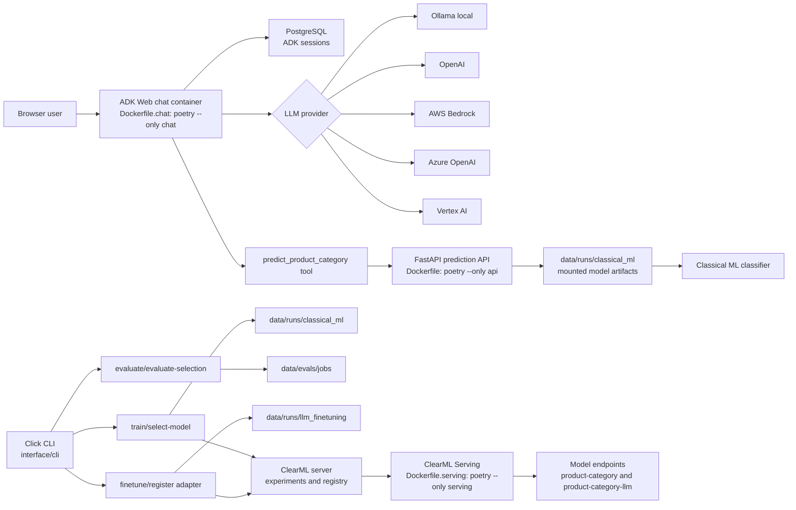

The runtime split is intentional. Chat installs only ADK/chat dependencies, the API installs only prediction dependencies, and ClearML Serving installs only serving dependencies; `.dockerignore` keeps `.venv`, `data`, caches, and secrets out of Docker build context. Training, evaluation, and fine-tuning remain CLI workflows that write artifacts into `data/`, which are mounted into runtime services when needed.

## Local Compose Services

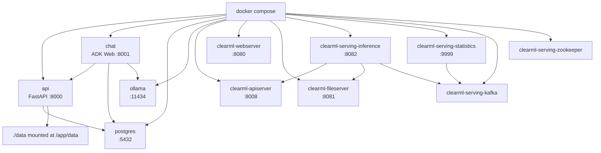

The cloud modules are advanced deployment scaffolding. Keep the local
`make demo-train` plus `make up-dev-ollama` path as the primary demo, and run a
provider-specific Terraform plan/apply smoke test before presenting AWS, Azure,
or GCP as an active production deployment.

## AWS Services

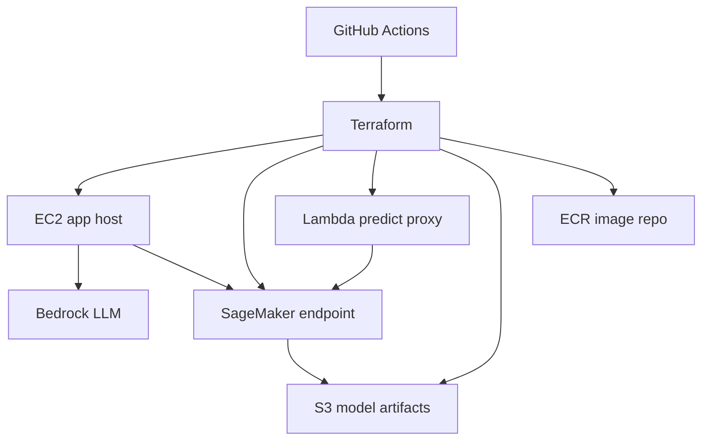

AWS Terraform lives in `infra/aws` and provisions VPC networking, EC2 app host, RDS PostgreSQL, SageMaker model endpoint, Lambda predict proxy, S3 artifacts, ECR, and IAM roles. The workflow expects the image/model artifact inputs to be supplied through GitHub Actions secrets before `plan` or `apply`.

## Azure Services

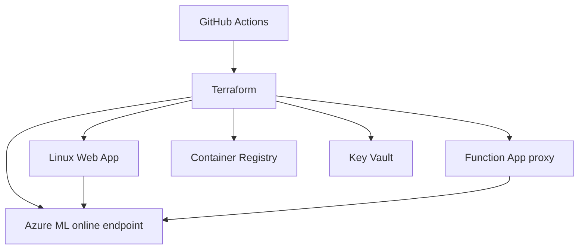

Azure Terraform lives in `infra/azure` and provisions resource group, networking, Azure Database for PostgreSQL Flexible Server, ACR, Azure ML workspace and endpoint, Web App, Function App, storage, Key Vault, and optional Azure OpenAI account. The Function proxy forwards prediction payloads to the configured Azure ML scoring URI.

## GCP Services

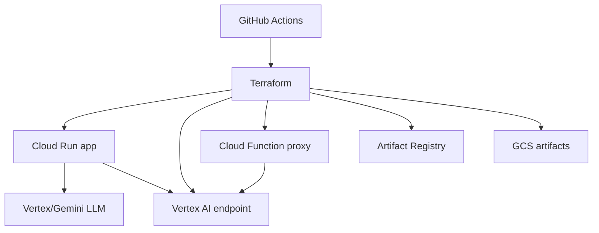

GCP Terraform lives in `infra/gcp` and provisions Artifact Registry, GCS artifacts, Cloud SQL PostgreSQL, Cloud Run app service, Vertex AI model endpoint, Cloud Function proxy, and IAM. The workflow expects the project id, model artifact URI, model serving image, and app image to be supplied through GitHub Actions secrets.

## Usage Flow

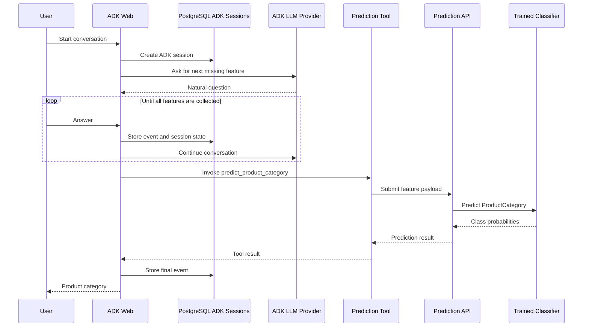

## Data

Dataset path:

```text
data/customer_purchase_data.csv
```

Columns:

| Column | Role |
| --- | --- |
| `Age` | Feature |
| `Gender` | Feature |
| `AnnualIncome` | Feature |
| `NumberOfPurchases` | Feature |
| `ProductCategory` | Target |
| `TimeSpentOnWebsite` | Feature |
| `LoyaltyProgram` | Feature |
| `DiscountsAvailed` | Feature |
| `PurchaseStatus` | Feature |

The zip and example project under `data/example` are not used as runtime inputs.

## CI/CD

GitHub Actions:

```text
.github/workflows/ci.yml
.github/workflows/deploy.yml
.github/workflows/teardown.yml
```

`ci.yml` runs package checks, Python compile checks, Black format checks, Prospector linting, and the test suite on pull requests and pushes to `main`/`master`. `deploy.yml` and `teardown.yml` are manual `workflow_dispatch` jobs; choose `aws`, `azure`, or `gcp`, deploy supports `plan` and `apply`, and teardown runs `destroy`.

Cloud deploy workflows read required Terraform inputs from repository secrets: `CHAT_DB_PASSWORD`, `CONTAINER_IMAGE`, `MODEL_IMAGE`, `MODEL_DATA_URL`, `AZURE_OPENAI_API_KEY`, `AZURE_OPENAI_ENDPOINT`, `AZURE_ML_MODEL_ID`, `AZURE_ML_ENVIRONMENT_ID`, `AZURE_ML_SCORING_URI`, `AZURE_ML_API_KEY`, `GCP_PROJECT_ID`, `GCP_MODEL_ARTIFACT_URI`, and `GCP_MODEL_SERVING_IMAGE`, plus the provider identity secrets listed in the environment table.
